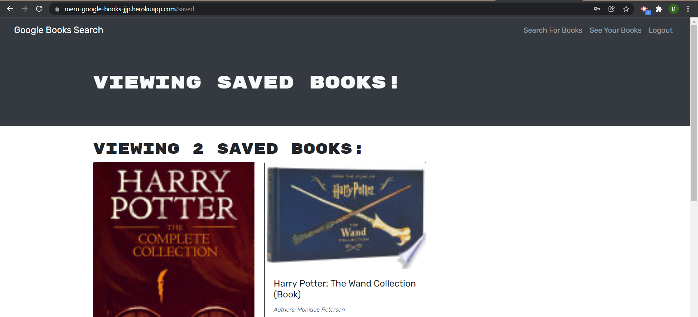

# Book Search Engine Starter Code

## Description 

Awesome Google books search engine using the power of MERN. Application was upadted to replace the existing Routes and HTTP calls with GRAPHQL and ApolloServer. This application will look for any book titles you want and then give you the ability to save the book info in your account. 

## Challenge Requirements 
 * Use MONGODB
 * Use Mongoose
 * Deployed in Heroku
 * Search Engine loads
 * Convert RESTFUL API to GRAPHQL.
 * Ability to Login or Create User
 * Ability to Save/Delete Books to account
## Table of Contents

* [Installation Manual](#installation-manual)
* [Usage-Manual-INSOMNIA](#usage-manual-insomnia)
* [Screenshots](#screenshots)
* [License](#license)

## Usage-Manual-HEROKU

1. Go to the applications deployed webpage. `https://mern-google-books-jjp.herokuapp.com/`
2. Create/Login account
3. Search any book you want :)   
4. Save/Delete any book for future reference   

## Screenshots

## License

ISC
    

